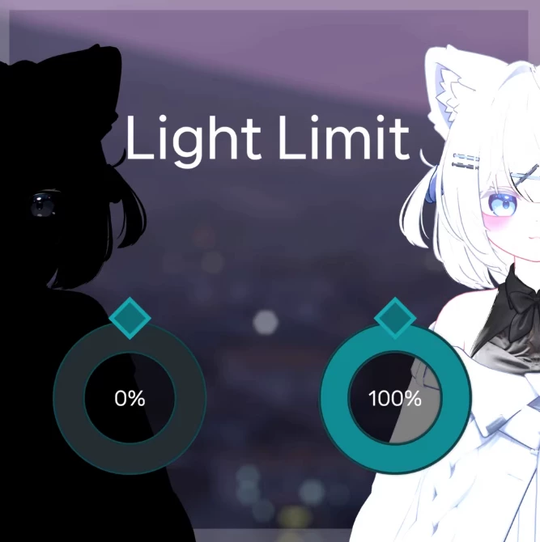
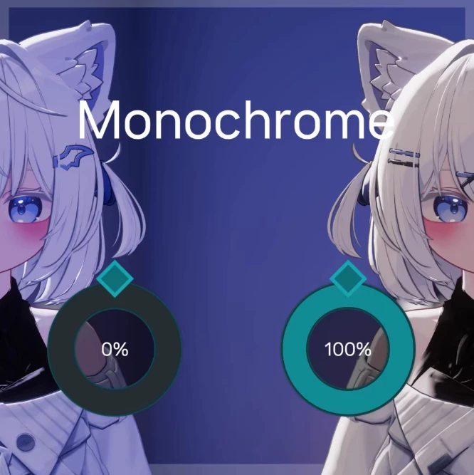
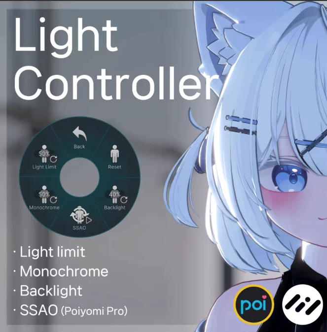

# The VRChat plugin "Light Controller" is a tool for adjusting the brightness of the lights in the virtual environment. It helps users to adjust the intensity of the lights in the virtual space according to their needs, providing a more comfortable visual experience.

## Body

VRChat Plugin - Brightness Adjustment - Light Controller

(Full product description was not available from the source page.)

## Images

## Payment

Here is a pay link on Stripe ( https://buy.stripe.com/3cs8yP7sY87d0vu9AB ). Please contact me lonlonago@foxmail.com after funding $89, and I will send you a complete data files , thank you!

